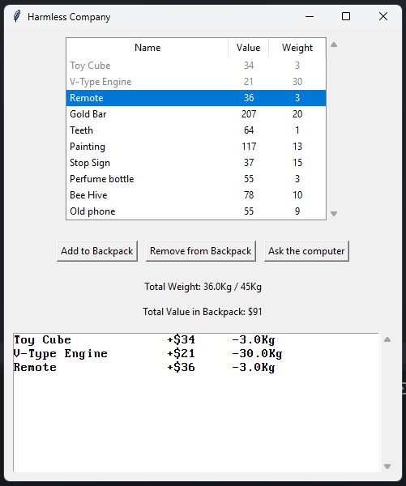
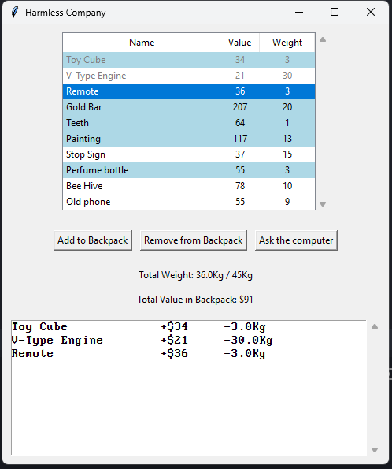
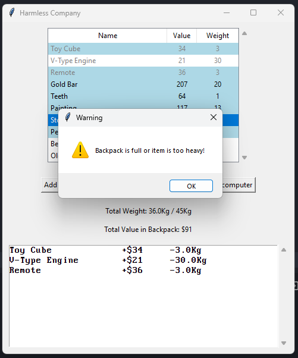

# Harmless Company

[Vídeo de apresentação](https://youtu.be/ihqoDbjzobE)

**Número da Lista**: 1 
**Conteúdo da Disciplina**: Programação Dinâmica 

## Alunos

| Matrícula  | Aluno                        |
| ---------- | ---------------------------- |
| 19/0036567 | Pedro Lucas Cassiano Martins |
| 19/0020814 | Vinícius Roriz               |

## Sobre

Harmless Company é um joguinho inspirado em Lethal Company, onde o jogador deve escolher itens para adicionar à sua mochila com o objetivo de obter o maior valor possível sem exceder o limite de peso. Nesse jogo, o jogador pode adicionar e remover itens da mochila, e se precisar de ajuda, recorrer ao computador de bordo da nave para ver a combinação ótima de itens. O computador utiliza o algoritmo Knapsack 0/1 com programação dinâmica para selecionar os itens que maximizam o valor total.

## Screenshots

## Instalação

**Linguagem**: Python 

##### Execute a main.py

`$ python3 src/main.py`

## Uso

1. Escolha itens e use o botão `Add to Backpack` para adicioná-los na mochila
2. Tente atingir o maior valor possível dentro da capacidade da mochila
3. Para checar a combinação ótima de itens, use o botão `Ask the computer`
4. Para remover um item da mochila, selecione ele na lista inferior e use o botão `Remove from Backpack`
